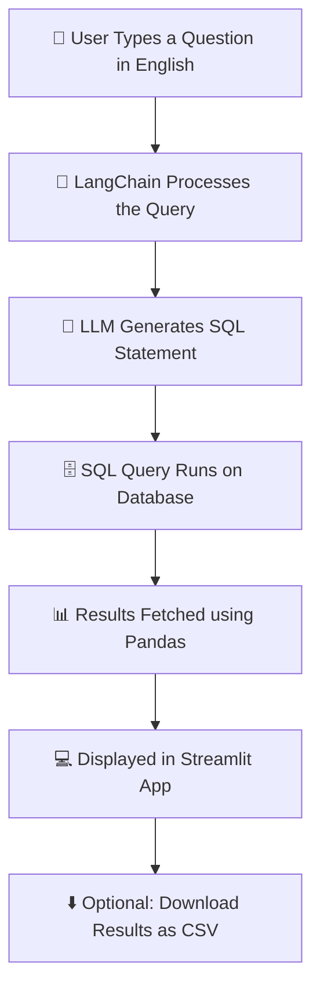

# SQL Chatbot using LangChain & Streamlit

🚀 A smart, conversational chatbot that lets you interact with your SQL database **using plain English** 
 — no SQL knowledge required!  
Built with **LangChain** for natural language processing, **Streamlit** for a sleek interface, and your favorite database as the backend.  

💡 Just ask a question like *"Show me the top 5 customers by sales"* and watch it instantly turn into SQL, execute it, and give you the results.

## 📸 Demo

Here’s a quick look at the SQL Chatbot in action:

add video 

add screenshot

## 🤖 What Does the SQL Chatbot Do?

This chatbot bridges the gap between **natural language** and **SQL queries**.  
You don’t have to remember any SQL commands — just type your question in plain English.

### 🔍 How It Works for You:
- **Ask in English** → *"Show me sales in January 2024"*
- **Chatbot Converts** → Generates the exact SQL statement
- **Executes & Fetches** → Runs the query on your database
- **Shows Results** → Displays data in a clean, interactive table
- **Download Option** → Export your results instantly as a CSV

✨ *Think of it as your personal database assistant — always ready to answer, 24/7.*

## 🌟 Features

✅ **Natural Language to SQL** – No need to write SQL manually, just ask in plain English.  
✅ **Supports Multiple Databases** – Works with SQLite, MySQL, or PostgreSQL.  
✅ **Instant Execution** – Query runs in real time with fast results.  
✅ **CSV Export** – Download your results in one click.  (Ongoing)
✅ **Simple UI** – Built with Streamlit for a clean and minimal experience.  
✅ **Beginner-Friendly** – Perfect for those new to SQL.

## 🔄 How It Works – Flowchart

##  Project Overview

##  What does SQL Chatbot do ???

## Working Video

# Flow Chart

## Tech Stack
 - Python
 - Streamlit – Web app UI
 - LangChain – LLM orchestration
 - SQLite / MySQL
 - Pandas – Data processing

## Future Improvements
 - Multi-LLM comparison with LangGraph.
 - Support for more databases.
 - Add authentication for database security.
 - Add a Downloadable csv button.

## How to Use SQL Chatbot

## Requirements

