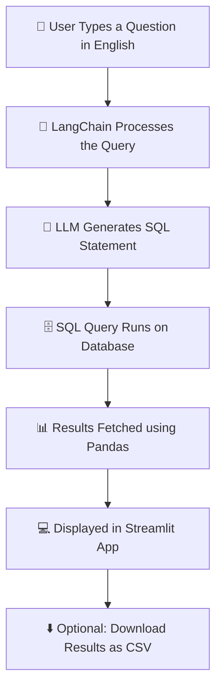

# SQL Chatbot using LangChain & Streamlit

🚀 A smart, conversational chatbot that lets you interact with your SQL database **using plain English** 
 — no SQL knowledge required!  
Built with **LangChain** for natural language processing, **Streamlit** for a sleek interface, and your favorite database as the backend.  

💡 Just ask a question like *"Show me the top 5 customers by sales"* and watch it instantly turn into SQL, execute it, and give you the results.

## 📸 Demo

Here’s a quick look at the SQL Chatbot in action:


add video 


add screenshot

## 🤖 What Does the SQL Chatbot Do?

This chatbot bridges the gap between **natural language** and **SQL queries**.  
You don’t have to remember any SQL commands — just type your question in plain English.

### 🔍 How It Works for You:
- **Ask in English** → *"Show me sales in January 2024"*
- **Chatbot Converts** → Generates the exact SQL statement
- **Executes & Fetches** → Runs the query on your database
- **Shows Results** → Displays data in a clean, interactive table
- **Download Option** → Export your results instantly as a CSV

✨ *Think of it as your personal database assistant — always ready to answer, 24/7.*

## 🌟 Features

✅ **Natural Language to SQL** – No need to write SQL manually, just ask in plain English.  
✅ **Supports Multiple Databases** – Works with SQLite, MySQL, or PostgreSQL.  
✅ **Instant Execution** – Query runs in real time with fast results.  
✅ **CSV Export** – Download your results in one click.  (Ongoing)
✅ **Simple UI** – Built with Streamlit for a clean and minimal experience.  
✅ **Beginner-Friendly** – Perfect for those new to SQL.


## 🔄 How It Works – Flowchart



## 🛠️ Tech Stack

**Languages & Frameworks**
- 🐍 Python
- 🖥️ Streamlit – For the interactive web app
- 🤖 LangChain – Natural language to SQL conversion
- 🗄️ SQLite / MySQL / PostgreSQL – Database backend
- 🐼 Pandas – Data handling & formatting

**APIs & Services**
- OpenAI API (or your chosen LLM provider)

**Version Control**
- Git & GitHub

## ⚙️ Installation & Using

1️⃣ **Clone the repository**
```bash
git clone https://github.com/yourusername/sql-chatbot.git
cd sql-chatbot
```
2️⃣**Create a virtual environment**
```bash
python -m venv venv
venv\Scripts\activate 
```
3️⃣**Install dependencies**
```bash
pip install -r reqq.txt
```
4️⃣**Run the app**
```bash
streamlit run app.py
```

## 🔧 Setup

1️⃣ **Add your API key**  
- Create a `.env` file in the project root:

*(Replace with your actual API key from OpenAI or your chosen LLM provider.)*

2️⃣ **Configure your database connection**  
- Open `config.py` and update with your database details:
```python
DB_TYPE = "sqlite"  # or "mysql", "postgresql"
DB_NAME = "your_database.db"
DB_USER = "username"      # for MySQL/PostgreSQL
DB_PASSWORD = "password"  # for MySQL/PostgreSQL
DB_HOST = "localhost"     # or your DB server address
```

## Ask your question
```chat
"Show me the top 5 products by sales in 2024"
```
 - Get your results instantly

## 📂 Project Structure

sql-chatbot/
│-- app.py               # Main Streamlit application
│-- config.py            # Database configuration settings
│-- requirements.txt     # Python dependencies
│-- .env.example         # Example environment variables
│-- README.md            # Project documentation
│-- assets/              # Screenshots, GIFs, diagrams
│     ├── demo.gif
│     ├── screenshot.png
│     └── flowchart.png

## 🚀 Future Improvements

- 🔄 **Multi-LLM Support** – Compare results from different LLMs (using LangGraph).
- 📊 **Advanced Analytics** – Support for more complex analytical SQL queries.
- 🔐 **User Authentication** – Secure access with login for private databases.
- 🌐 **Cloud Deployment** – Host on platforms like Streamlit Cloud, AWS, or Hugging Face Spaces.
- 🗣️ **Voice Input** – Ask database queries using speech-to-text.
- 📅 **Scheduled Reports** – Automatically email query results at set intervals.


## 📜 License

This project is licensed under the **MIT License** — you’re free to use, modify, and distribute it, provided you include the original license notice.

See the [LICENSE](LICENSE) file for full details.
